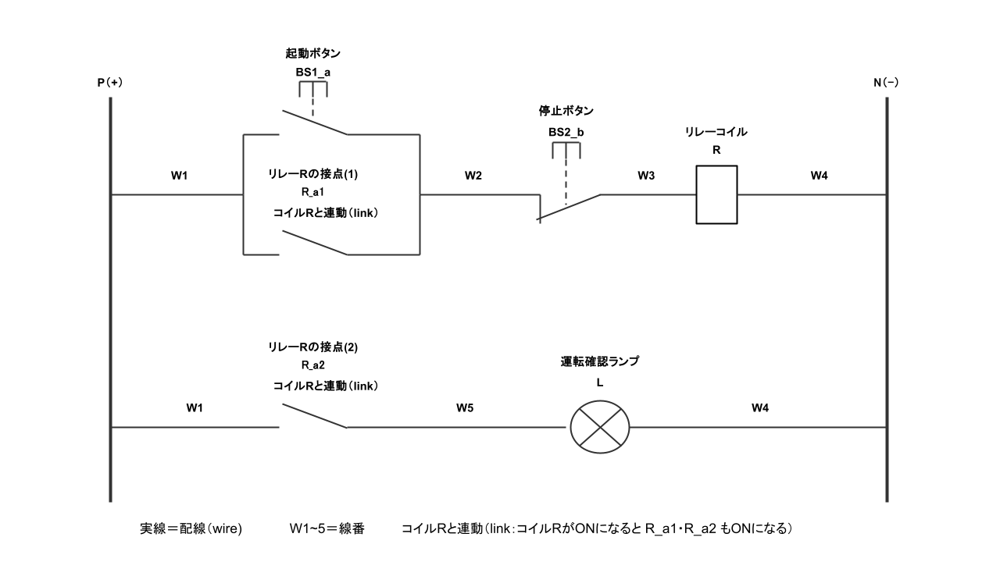
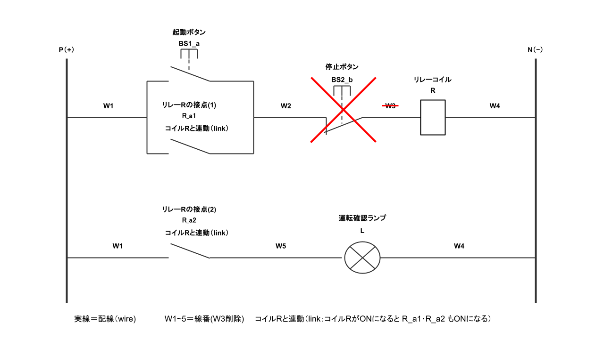
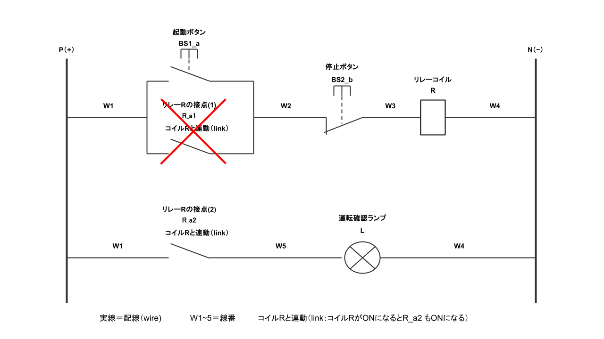

# 制御回路の自動検証とグラフ可視化ツール

## 1. 概要

制御盤の回路図に潜む配線ミス、たとえば停止ボタンの配線忘れや自己保持の配線ミスを、自動で検証する仕組みが欲しくて作ったツールです。

回路の情報を書いたExcelファイルを2つ読み込み、次の3つを行います。

1. 各出力（コイル・ランプ）がONになる条件を、論理式として導出する
2. 検査ルールの表に基づいて回路を検査し、問題を深刻度付きで報告する
3. 回路をグラフ（点と線のつながり）として描画し、問題のある部品を赤色で強調する

### 1.1. 入力する2つのExcelファイル

本ツールは、役割の異なる2つのExcelファイルを入力とします。以下、本文ではこの区別で呼び分けます。

| ファイル | 何を表しているファイルか |
| --- | --- |
| **回路構成部品リスト.xlsx**（回路データ） | 検査したい回路そのものの構成。どんな部品があり、どうつながっているか。回路1つにつき1ファイル用意します。 |
| **検査リスト.xlsx**（ルールデータ） | 「何を欠陥とみなすか」という検査ルール。原則1ファイルを使い回し、複数の回路に同じルールを適用します。 |

回路構成部品リスト.xlsxは「検査される側」、検査リスト.xlsxは「検査する側」です。回路を変えても検査基準は変わらないため、この2つは別ファイルに分けています。

### 1.2. 主な機能

- **条件式の導出**：各コイル・ランプがONになる条件を `(BS2_b AND (BS1_a OR R_a1))` のような論理式で出力します。詳しくは「4. 条件式の導出について」を参照してください。
- **検査ルールの表による検査**：検査ルールはコード内には書かれていません。すべて **検査リスト.xlsx** に表として定義し、そこを読み込んで実行します。検査タイプの一覧は「3.2.2. 検査タイプの一覧」を参照してください。
- **対話型の可視化**：pyvisでHTMLのグラフを生成し、Colab上に埋め込み表示します。問題が見つからなかった部品は水色のまま表示され、問題が見つかった部品は赤系の色と太枠で強調されます。すべての部品に問題が無ければ、図全体が水色のままになります。ファイル `graph.html` としても書き出されます。
- **回路構成部品リストの検証**：読み込んだ回路構成部品リスト.xlsxについて、空行の除去、ID表記ゆれの除去（前後空白のstrip）、ノードリストとエッジリストのID整合チェックを行い、部品名の打ち間違いの候補を表示します。

---

## 2. サンプル回路（自己保持回路）

本ツールに同梱している回路データは、次の自己保持回路です。以降の説明は、この回路を例に進めます。



回路の構成は次のとおりです。

- **1段目（コイルの回路）**：起動ボタン `BS1_a` を押すとコイル `R` がONになります。`R` がONになると、それに連動する自己保持接点 `R_a1` もONになり、起動ボタンを離してもコイルがONのまま保たれます。停止ボタン `BS2_b` を押すと回路が切れ、コイルがOFFになります。
- **2段目（確認ランプの回路）**：コイル `R` に連動する接点 `R_a2` によって、運転確認ランプ `L` が点灯します。

`W1` から `W5` は**線番**です。部品と部品の間の配線に付けた名前で、回路をグラフとして扱うときの「点」になります。

**`R_a1` と `R_a2` は、コイル `R` によって動く接点です。** 電線でつながっているわけではないため、配線とは別に「連動（link）」として登録します。

---

## 3. 入力ファイルの仕様と作成手順

### 3.1. 回路構成部品リスト.xlsx（回路データ）

検査したい回路の構成を書くファイルです。**「ノードリスト」「エッジリスト」の2シート**が必要です。シート名は完全一致で判定されるため、名前を変えないでください。

#### 3.1.1. シート「ノードリスト」

**このシートに書くこと：回路にどんな部品があるかの一覧。**

回路を構成する部品（ボタン、接点、コイル、ランプ）と、母線を1行ずつ登録します。「部品の名簿」にあたるシートです。

「列の要否」は、**その列そのものを省略できるかどうか**を表します。「必須」の列が無いと、読み込み時にエラーになります。

| 列名 | 列の要否 | 内容 |
| --- | --- | --- |
| `ノード` | 任意（省略可） | 通し番号。管理用の列で、処理には使われません（属性からは除外されます）。 |
| `name` | **必須（省略不可）** | 部品の識別名。この回路の中で重複しない名前を付けます。エッジリストの始点・終点には、ここに書いた名前をそのまま書きます。 |
| `kind` | **必須（省略不可）** | 部品の種類。下表の値から選びます。 |
| その他の列 | 任意（省略可） | 自由に追加できます。追加した列は、その部品の属性としてグラフに保持され、図のラベルに表示されます（例：`部品番号`、`備考`）。 |

**`kind` 列に書ける値**

| 値 | 意味 | 処理上の扱い |
| --- | --- | --- |
| `power_bus` | 母線 | 「点」として扱われます。電源側の母線は `name` を **`P`** にしてください（コード側で電源の起点として名前を直接参照しているため）。 |
| `wire_node` | 線番 | 「点」として扱われます。 |
| `coil` | コイル | 「線」として扱われる出力部品。検査の対象になります。 |
| `lamp` | ランプ | 「線」として扱われる出力部品。条件式は出力されますが、ルール検査の対象はコイルのみです。 |
| `b_contact` | b接点 | 「線」として扱われます。 |
| 上記以外 | a接点など | 上記以外の文字列も自由に使えます（例：`a_contact`）。「線」として扱われ、検査ルールの「種類」指定で参照できます。 |

**名前の付け方の注意**

- `name` は**半角の英数字とアンダースコア**で付けてください。条件式から部品名を取り出す処理が、この文字種を1単語として扱うためです。日本語やハイフンを含む名前は、検査が正しく働かない場合があります。
- 線番の名前は **`W` で始める**ことを推奨します。エッジリストにあってノードリストに無い名前は、線番として自動登録されますが、その際に「`W` で始まらない名前」は部品名の打ち間違いの可能性ありとして警告されます。

#### 3.1.2. シート「エッジリスト」

**このシートに書くこと：部品どうしがどうつながっているかの一覧。**

つながり1本を1行として登録します。「配線の結線表」にあたるシートです。

| 列名 | 列の要否 | 内容 |
| --- | --- | --- |
| `始点` | **必須（省略不可）** | つながりの一方の端の名前。 |
| `終点` | **必須（省略不可）** | つながりのもう一方の端の名前。 |
| `type` | **必須（省略不可）** | つながりの種類。`wire` または `link` を書きます。 |
| その他の列 | 任意（省略可） | 自由に追加できます。追加した列は、そのつながりの属性として図のラベルに表示されます。 |

**`type` 列の2つの値**

| 値 | 意味 | 向きの扱い |
| --- | --- | --- |
| `wire` | 配線（電気的なつながり） | **向きは問いません。** 始点と終点をどちらの順で書いても結果は変わりません。実際のCADの接続リストに向きが記録されていないため、向きに依存しない処理にしてあります。図でも矢印を出しません。 |
| `link` | 連動（コイルとその接点の対応） | **向きに意味があります。** 必ず **始点＝コイル、終点＝接点** の順で書いてください。図では点線＋矢印で表示されます。 |

**接続の書き方のきまり**

- 部品（コイル・接点・ランプ）は、**必ず2つの点（線番または母線）に挟まれる**ように書きます。片側しかつながっていない部品、3つ以上につながっている部品は、条件式の導出から除外されます。
- 部品を挟まずに線番どうしが直結している場合（例：`P` と `W1`）、それらは電気的に同じ点として自動的に統合されます。
- コイル・ランプは、**N母線側（電源 `P` から見て負荷側）に置いて**ください。電源側の判定が、この回路上の慣習を利用しているためです。

#### 3.1.3. 回路構成部品リスト.xlsx の作成手順

「2. サンプル回路」の自己保持回路を例に、手順を示します。


<sub>PDF版：[docs/自己保持回路_正常.pdf](docs/自己保持回路_正常.pdf)</sub>

**手順1：回路図に線番を振る**

回路図の上で、部品と部品の間の配線に名前を付けます。母線は `P`（電源側）と `N`（もう一方）、その間の中継点を `W1`、`W2`…とします。部品が両側から挟まれる形になるよう、部品ごとの前後に必ず点があるようにします。

**手順2：Excelファイルを新規作成し、シート名を設定する**

新しいExcelブックを作り、シート名を `ノードリスト` と `エッジリスト` の2つにします。他のシートは削除するか、そのまま残しても構いません（読み込まれるのはこの2シートのみです）。

**手順3：「ノードリスト」シートに列名を書く**

1行目に列名を書きます。

| （行） | A列 | B列 | C列 |
| --- | --- | --- | --- |
| 1行目 | `ノード` | `name` | `kind` |

※ 左端の「（行）」は、Excelの何行目にあたるかを示すための説明です。**実際のExcelには、この列を作りません。**

**手順4：母線を登録する**

2行目から書き始めます。電源側の母線は必ず `P` という名前にします。

| （行） | ノード | name | kind |
| --- | --- | --- | --- |
| 2行目 | 1 | `P` | `power_bus` |
| 3行目 | 2 | `N` | `power_bus` |

**手順5：部品を登録する**

続けて、回路図に現れる部品を1行ずつ登録します。

| （行） | ノード | name | kind |
| --- | --- | --- | --- |
| 4行目 | 3 | `BS1_a` | `a_contact` |
| 5行目 | 4 | `BS2_b` | `b_contact` |
| 6行目 | 5 | `R` | `coil` |
| 7行目 | 6 | `R_a1` | `a_contact` |
| 8行目 | 7 | `R_a2` | `a_contact` |
| 9行目 | 8 | `L` | `lamp` |

- 停止ボタンは、押していないときに閉じているb接点なので `b_contact` とします。
- `R_a1` は、コイル `R` に連動する自己保持用のa接点です。
- `R_a2` は、同じくコイル `R` に連動する、確認ランプ点灯用のa接点です。

**手順6：線番は登録を省略できる**

`W1`、`W2` などの線番は、ノードリストに書かなくても構いません。エッジリストにだけ書いておけば、線番として自動登録されます。ノードリストに記述する場合、`kind` を `wire_node` として登録してください。

**手順7：「エッジリスト」シートに列名を書く**

1行目に列名を書きます。

| （行） | A列 | B列 | C列 |
| --- | --- | --- | --- |
| 1行目 | `始点` | `終点` | `type` |

※ 左端の「（行）」は、Excelの何行目にあたるかを示すための説明です。**実際のExcelには、この列を作りません。**

**手順8：配線を1本ずつ書き出す**

回路図をたどりながら、「点 → 部品 → 点」の順で、つながりを2行ずつ書いていきます。**ここでいう「点」とは、手順1で名前を付けた線番、つまり配線1本のことです。** 部品の両側にある配線を、それぞれ1つの点として扱います。

「2. サンプル回路」の図に沿って書くと、次のようになります。

| （行） | 始点 | 終点 | type | この行が表しているもの |
| --- | --- | --- | --- | --- |
| 2行目 | `P` | `W1` | `wire` | 電源側母線と線番W1の直結 |
| 3行目 | `W1` | `BS1_a` | `wire` | W1から起動ボタンへ |
| 4行目 | `BS1_a` | `W2` | `wire` | 起動ボタンからW2へ |
| 5行目 | `W1` | `R_a1` | `wire` | W1から自己保持接点へ |
| 6行目 | `R_a1` | `W2` | `wire` | 自己保持接点からW2へ |
| 7行目 | `W2` | `BS2_b` | `wire` | W2から停止ボタンへ |
| 8行目 | `BS2_b` | `W3` | `wire` | 停止ボタンからW3へ |
| 9行目 | `W3` | `R` | `wire` | W3からコイルへ |
| 10行目 | `R` | `W4` | `wire` | コイルからW4へ |
| 11行目 | `W1` | `R_a2` | `wire` | W1からランプ用接点へ |
| 12行目 | `R_a2` | `W5` | `wire` | ランプ用接点からW5へ |
| 13行目 | `W5` | `L` | `wire` | W5からランプへ |
| 14行目 | `L` | `W4` | `wire` | ランプからW4へ |
| 15行目 | `W4` | `N` | `wire` | W4と母線Nの直結 |

※ 左端の「（行）」は、Excelの何行目にあたるかを示すための説明です。**実際のExcelには、この列を作りません。** また、右端の「この行が表しているもの」は説明用のため、書く必要はありません（書いても動作には影響しません）。

- **2行目**で、電源側母線 `P` と線番 `W1` を直結しています。この2点は、部品を挟んでいないため電気的に同じ点として統合されます。
- **3〜6行目**が、起動ボタン `BS1_a` と自己保持接点 `R_a1` の並列です。**どちらも `W1` と `W2` の間に置かれている**ため、これが並列（OR）になります。
- **7〜8行目**で、並列の合流点 `W2` から停止ボタン `BS2_b` を通り、`W3` に至ります。ここは直列（AND）です。
- **9〜10行目**で、コイル `R` を `W3` と `W4` の間、つまりN母線側に置いています。
- **11〜14行目**が、確認ランプの回路です。`W1` から接点 `R_a2` を通り、`W5` を経てランプ `L` に至ります。
- **15行目**で、`W4` と母線 `N` を直結しています。

**手順9：連動を書く**

コイルと、そのコイルによって動く接点の対応を書きます。**始点がコイル**です。

| （行） | 始点 | 終点 | type | この行が表しているもの |
| --- | --- | --- | --- | --- |
| 16行目 | `R` | `R_a1` | `link` | コイルRがONになると自己保持接点も動く |
| 17行目 | `R` | `R_a2` | `link` | コイルRがONになるとランプ用接点も動く |

**手順10：ファイル名を付けて保存する**

`回路構成部品リスト.xlsx` として、Google Driveの所定のフォルダに保存します。

**手順11：実行して整合を確認する**

実行後、最初に表示されるID整合チェックの結果を確認します。

- 「うち、線番らしくない名前」に何か表示された場合、部品名の打ち間違いの可能性が高いです。
- 「ノードリストにあるがエッジ未使用」に表示されたノードは、どこにもつながっていない孤立ノードです。配線の書き漏らしを確認してください。

---

### 3.2. 検査リスト.xlsx（ルールデータ）

**「何を欠陥とみなすか」を書くファイルです。** 検査の判定内容はコード側には一切書かれておらず、すべてこのファイルから読み込まれます。ルールを追加・変更するときは、コードではなくこのファイルを編集します。

シートは**「ルール一覧」と「使い方」の2つ**です。

| シート | 役割 |
| --- | --- |
| `ルール一覧` | 検査ルールの本体。**コードが読み込むのはこのシートだけです。** |
| `使い方` | 編集するときの注意事項をまとめた説明シート。コードは読み込みません。ルールを編集する人が、その場で書き方を確認できるように用意しています。 |

#### 3.2.1. シート「ルール一覧」

**このシートに書くこと：検査ルールの一覧。1行が1つのルールです。**

回路内のすべてのコイルに対して、ここに書いたルールが上から順に適用されます。

**Pythonコードにて読み込む各列の説明**

| 列名 | 列の要否 | 内容 |
| --- | --- | --- |
| `有効` | **必須（省略不可）** | このルールを使うかどうかのスイッチ。**何か文字が入っていれば適用**され、空欄なら読み飛ばされます（例：`○`）。ルールを一時的に止めたいときは、行を消さずにこの欄を空にします。 |
| `ルール名` | **必須（省略不可）** | ルールの名前。実行時に「適用するルール」として一覧表示されます。 |
| `深刻度` | 任意（空欄可） | 問題を報告するときの区分（例：`危険`、`注意`）。結果は `[深刻度] メッセージ` の形で表示されます。空欄の場合は `注意` が使われます。 |
| `検査タイプ` | **必須（省略不可）** | どういう検査をするかの種類。下表の5つのいずれかを、表記どおりに書きます。ここにない値を書くと、警告が表示されてその行は飛ばされます。 |
| `パラメータ` | 検査タイプによる | 検査の対象を指定する値。検査タイプごとに意味が変わります（下表）。 |
| `メッセージ` | **必須（省略不可）** | 問題が見つかったときに表示する文章。 |

#### 3.2.2. 検査タイプの一覧

**`パラメータ` 列に書いた値は、その行の `検査タイプ` に応じた「検査の対象」として使われます。** 検査タイプが処理の「やり方」を決め、パラメータがその「対象」を決める、という関係です。

| 検査タイプ | パラメータの値が、どう使われるか |
| --- | --- |
| `条件式に種類が含まれる` / `条件式に種類が含まれない` | 書いた値を、ノードリストの `kind` 列と照合します。その種類にあてはまる部品名をすべて集めたうえで、それらが条件式の中にあるかどうかを調べます。例：`b_contact` と書くと、`kind` が `b_contact` の部品（サンプルでは `BS2_b`）が対象になります。 |
| `条件式に名前が含まれる` | 書いた値を、部品名そのものとして扱い、条件式の中にその名前があるかどうかを調べます。例：`EMS` と書くと、`EMS` という名前の部品だけが対象になります。 |
| `自己保持している` / `条件式が空でない` | パラメータは使いません。空欄で構いません。対象となる部品は、検査中のコイルとその連動接点から自動的に決まります。 |

なお、条件式との照合は、**単語単位の一致**で行われます。たとえば `R` と `R_a1` は別の単語として扱われるため、`R` を指定したときに `R_a1` が誤ってあてはまることはありません。

| 検査タイプ | パラメータに書くもの | 「問題あり」と判定される条件 |
| --- | --- | --- |
| `条件式に種類が含まれる` | `kind` の値（例：`b_contact`） | その種類の部品が、条件式に**1つも含まれていない**とき。停止ボタン（b接点）の入れ忘れの検出に使えます。 |
| `条件式に種類が含まれない` | `kind` の値（例：`coil`） | その種類の部品が、条件式に**含まれている**とき。入っていてはいけない部品の検出に使えます。 |
| `条件式に名前が含まれる` | 部品の `name`（例：`EMS`） | その名前の部品が、条件式に**含まれていない**とき。特定の非常停止接点の入れ忘れの検出に使えます。 |
| `自己保持している` | （使いません。空欄可） | そのコイルに連動する接点があるにもかかわらず、その接点が条件式に含まれていない、または並列の位置にないとき。自己保持の配線ミスの検出に使えます。連動する接点が1つも無いコイルは対象外です。 |
| `条件式が空でない` | （使いません。空欄可） | 条件式が空、または `(条件なし)` のとき。コイルが電源からたどり着けないなど、成立条件が存在しない状態の検出に使えます。 |

#### 3.2.3. メッセージ欄で使える差し込み

`メッセージ` 列には、実行時に実際の値へ置き換わる差し込み記号を書けます。

| 記号 | 置き換わる内容 |
| --- | --- |
| `{coil}` | 検査中のコイルの名前 |
| `{expr}` | そのコイルの条件式 |
| `{own}` | そのコイルに連動する接点の名前（複数ある場合は `, ` 区切り） |

記入例：

```
コイル {coil} の条件式に停止用のb接点がありません。現在の条件式: {expr}
```

#### 3.2.4. 検査リスト.xlsx の作成手順

**手順1：Excelファイルを新規作成し、シート名を設定する**

新しいExcelブックを作り、シート名を `ルール一覧` にします。

**手順2：3行目に列名を書く**

| （行） | A列 | B列 | C列 | D列 | E列 | F列 |
| --- | --- | --- | --- | --- | --- | --- |
| 3行目 | `有効` | `ルール名` | `深刻度` | `検査タイプ` | `パラメータ` | `メッセージ` |

※ 左端の「（行）」は、Excelの何行目にあたるかを示すための説明です。**実際のExcelには、この列を作りません。**

列の順番は自由ですが、**列名は表記どおりに書いてください**。列名の行を1行目にしたい場合は、コード側の `RULES_HEADER_ROW` を `0` に変更してください。

**手順3〜5：ルールを1行ずつ書く**

4行目から、ルールを1行ずつ書いていきます。

| （行） | 有効 | ルール名 | 深刻度 | 検査タイプ | パラメータ | メッセージ |
| --- | --- | --- | --- | --- | --- | --- |
| 4行目 | `○` | 停止手段があるか | 危険 | `条件式に種類が含まれる` | `b_contact` | `{coil}` の条件式に停止用のb接点が含まれていません。一度ONになると止められない可能性があります。 |
| 5行目 | `○` | 自己保持しているか | 注意 | `自己保持している` | （空欄） | `{coil}` に自己保持用の接点が見当たりません。起動ボタンと並列に `{coil}` 自身の接点が入っていない可能性があります（連動する接点: `{own}`）。 |
| 6行目 | `○` | 到達不能コイルでないか | 危険 | `条件式が空でない` | （空欄） | `{coil}` は電源からたどり着けません。配線が抜けていて、一生ONにならない可能性があります。 |

※ 左端の「（行）」は、Excelの何行目にあたるかを示すための説明です。**実際のExcelには、この列を作りません。**

- 4行目は、停止ボタンの配線忘れを検出するルールです。`パラメータ` に `b_contact` と書くことで、b接点（停止ボタン）が検査の対象になります。
- 5行目は、自己保持の配線ミスを検出するルールです。この検査タイプでは `パラメータ` を使わないため、空欄のままで構いません。
- 6行目は、条件式が導出できないコイル（電源からたどり着けない部品）を検出するルールです。

**手順6：必要に応じてルールを追加する**

現場で確認している観点を、1つずつ行として追加していきます。追加のたびにコードを書き換える必要はありません。

**手順7：一時的に止めたいルールを無効化する**

そのルールの `有効` 列を空欄にします。行を削除する必要はありません。

**手順8：「使い方」シートを用意する**

必要に応じて、`使い方` という名前のシートをもう1つ作り、編集するときの注意事項を書いておきます。**このシートはコードが読み込まないため、書式は自由です。** 同梱の検査リスト.xlsx には、次の内容を記載しています。

| 項目 | 内容 |
| --- | --- |
| 使い方 | 「有効」列に○を入れたルールだけが実行されます。空欄にすると一時的に無効にできます。 |
| メッセージの書き方 | `{coil}` はコイル名、`{expr}` は条件式、`{own}` は連動する接点の一覧に置き換わります。 |
| 検査タイプ | 「ルール一覧」シートにある名前のみ使えます。 |
| 注意 | ここに書くルールは安全に直結します。追加・変更したら、必ず正常な回路と欠陥のある回路の両方で試してください。 |

ルールの表を編集する人と、コードを書いた人が同じとは限らないため、**編集の約束ごとを同じファイル内に残しておく**ことを想定した補助シートです。

**手順9：ファイル名を付けて保存する**

`検査リスト.xlsx` として、回路構成部品リスト.xlsx と同じフォルダに保存します。

**手順10：実行して適用状況を確認する**

実行後、「適用するルール: ○件」の表示で、意図したルールが読み込まれているかを確認します。件数が合わない場合は、`有効` 列の記入漏れか、`検査タイプ` の表記ミスです。表記ミスの場合は警告が表示されます。

---

## 4. 条件式の導出について

このツールの中心となる出力が「条件式」です。

### 4.1. 条件式とは何か

条件式とは、**その出力（コイル・ランプ）がONになるためには、どの部品がどう成立していればよいか**を、一本の文にまとめたものです。

```
R : (BS2_b AND (BS1_a OR R_a1))
```

この式は「コイル R がONになるのは、BS2_b がONになっていて、かつ、BS1_a または R_a1 のどちらかがONになっているとき」と読みます。

- **AND**（かつ）は、回路上で部品が**直列**（一列）に並んでいることを表します。一列に並んだ部品は、全部そろわないと電気が通りません。
- **OR**（または）は、部品が**並列**（枝分かれ）に並んでいることを表します。枝分かれしている部品は、どれか1つ通れば電気が通ります。

つまり条件式は、回路図の形をそのまま文章に置き換えたものです。回路図を目で追わなくても、成立条件を文字で確認できます。

### 4.2. どうやって条件式を求めるか

回路の「線番」を点、「部品」を線と見立てて、内側にある小さなかたまりから順に、直列はANDで、並列はORで、1つにまとめていきます。

このように、「直列をまとめる」「並列をまとめる」という2つの操作を繰り返します。そうすると、最後には電源とコイルを結ぶ1本の式が残り、その式を**条件式**としています。

---

## 5. セットアップ・実行手順

1. Google Driveにフォルダを1つ作り、上記の手順で作成した入力ファイル2点を、そのフォルダに並べて配置する。フォルダ名は自由に決めて構いません（後述の `_DRIVE_DIR` に、そのパスを書きます）。
2. 本ノートブックをColabで開く。
3. Google Driveをマウントする（【要補足】：マウント処理は本コードに含まれていません。実行前に手動でのマウントが必要です）。
4. 先頭のセルを実行し、ライブラリと日本語フォントをインストールする。
5. 本体セルを実行する。

Google Driveに配置するフォルダ・入力ファイルと、Pythonコードにて定義するための定数名の一覧表を、下記に示します。フォルダ名やファイル名を変える場合は、コード冒頭の「設定値」ブロックにあるこれらの定数を書き換えてください。

| 定数 | 指すもの | 設定例 |
| --- | --- | --- |
| `_DRIVE_DIR` | 入力ファイル2点を置くフォルダ。回路構成部品リスト.xlsx と 検査リスト.xlsx は、**同じフォルダに並べて置きます**。フォルダ名は自由に決められます。Google Driveのマイドライブ直下に `作業フォルダ名` を作った場合、`/content/drive/MyDrive/` に続けてそのフォルダ名を書きます。 | `/content/drive/MyDrive/作業フォルダ名` |
| `FILE_PATH` | 回路構成部品リスト.xlsx のパス。`_DRIVE_DIR` の下にファイル名をつなげた形で指定します。 | `{_DRIVE_DIR}/回路構成部品リスト_自己保持回路_正常.xlsx` |
| `RULES_PATH` | 検査リスト.xlsx のパス。同じく `_DRIVE_DIR` の下を指します。 | `{_DRIVE_DIR}/検査リスト.xlsx` |
| `NODES_SHEET` / `EDGES_SHEET` | 回路データ側のシート名 | `ノードリスト` / `エッジリスト` |
| `RULES_SHEET` | ルールデータ側のシート名 | `ルール一覧` |
| `RULES_HEADER_ROW` | ルール一覧シートで、列名が書かれている行の位置（0から数えるため、Excelの3行目なら `2`） | `2` |
| `NODE_ID_COL` / `SOURCE_COL` / `TARGET_COL` / `SEQ_COL` | 各シートの列名 | `name` / `始点` / `終点` / `ノード` |

**別の回路を検査したい場合は、`FILE_PATH` のファイル名だけを書き換えます。** 検査リスト.xlsxは共通のため、`RULES_PATH` はそのままで構いません。

---

## 6. 実行結果の例

3つの回路構成部品リストで実行した結果です。検査リスト.xlsxは共通で、有効なルールは4件（停止手段があるか／コイルが混ざっていないか／自己保持しているか／到達不能コイルでないか）です。

### 6.1. 回路構成部品リスト_自己保持回路_正常.xlsx

停止ボタン `BS2_b` と自己保持接点 `R_a1` が、どちらも正しく配線されている回路です。「2. サンプル回路」の図と同じ構成です。

**この回路の回路図**


<sub>PDF版：[docs/自己保持回路_正常.pdf](docs/自己保持回路_正常.pdf)</sub>

```
ノード数: 13 エッジ数: 16
配線エッジ: 14 本 ／ 連動エッジ: 2 本 [('R', 'R_a1'), ('R', 'R_a2')]

各出力がONになる条件式（直並列縮約による導出）
  R : (BS2_b AND (BS1_a OR R_a1))
  L : R_a2

安全ルールによる検査結果
  適用するルール: 4件
  --- 判定 ---
    問題は見つかりませんでした。
```

コイル `R` の条件式には、停止用のb接点 `BS2_b` と、起動ボタン `BS1_a` と並列に置かれた自己保持接点 `R_a1` の両方が現れています。4つのルールすべてを満たすため、問題は報告されません。図では、すべての部品が水色のまま表示されます。

### 6.2. 回路構成部品リスト_自己保持回路_エラー出力_ルール_停止手段があるか.xlsx

正常な回路から、**停止ボタン `BS2_b` を削除**した回路です。

**この回路の回路図**（赤い×印が、正常な回路から削除した箇所です）



<sub>PDF版：[docs/自己保持回路_エラー出力_停止手段があるか.pdf](docs/自己保持回路_エラー出力_停止手段があるか.pdf)</sub>

```
ノード数: 11 エッジ数: 14
配線エッジ: 12 本 ／ 連動エッジ: 2 本 [('R', 'R_a1'), ('R', 'R_a2')]

各出力がONになる条件式（直並列縮約による導出）
  R : (BS1_a OR R_a1)
  L : R_a2

安全ルールによる検査結果
  適用するルール: 4件
  --- 判定 ---
    [危険] R の条件式に停止用のb接点が含まれていません。一度ONになると止められない可能性があります。
```

条件式から `BS2_b AND` の部分が消え、`(BS1_a OR R_a1)` だけになっています。「停止手段があるか」のルールが、条件式にb接点が1つも含まれていないことを検出し、`[危険]` として報告しています。図では、コイル `R` が赤系の色と太枠で強調されます。

**一度ONになると止める手段が回路上に存在しない状態**であり、現場では停止操作が効かない配線に相当します。

### 6.3. 回路構成部品リスト_自己保持回路_エラー出力_ルール_自己保持しているか.xlsx

正常な回路から、**自己保持接点 `R_a1` を削除**した回路です。

**この回路の回路図**（赤い×印が、正常な回路から削除した箇所です）



<sub>PDF版：[docs/自己保持回路_エラー出力_自己保持しているか.pdf](docs/自己保持回路_エラー出力_自己保持しているか.pdf)</sub>

```
ノード数: 12 エッジ数: 13
配線エッジ: 12 本 ／ 連動エッジ: 1 本 [('R', 'R_a2')]

各出力がONになる条件式（直並列縮約による導出）
  R : (BS1_a AND BS2_b)
  L : R_a2

安全ルールによる検査結果
  適用するルール: 4件
  --- 判定 ---
    [注意] R に自己保持用の接点が見当たりません。起動ボタンと並列に R 自身の接点が入っていない可能性があります（連動する接点: R_a2）。
```

条件式が `(BS1_a AND BS2_b)` となり、**ORが1つも現れていません**。起動ボタンと並列になる接点が無いためです。連動エッジも1本（`R → R_a2`）に減っています。

「自己保持しているか」のルールが、コイル `R` に連動する接点（`R_a2`）はあるものの、それが条件式の並列位置に無いことを検出し、`[注意]` として報告しています。**起動ボタンを押している間しか動かない回路**になっており、押しボタンを離すと止まってしまいます。

### 6.4. 3つの結果の比較

| 回路データ | 導出された条件式 | 検査結果 |
| --- | --- | --- |
| 正常 | `(BS2_b AND (BS1_a OR R_a1))` | 問題なし |
| 停止手段なし | `(BS1_a OR R_a1)` | `[危険]` b接点が含まれていない |
| 自己保持なし | `(BS1_a AND BS2_b)` | `[注意]` 自己保持接点が並列位置にない |

**同じコード・同じ検査リストのまま、回路データを差し替えるだけで、異なる欠陥がそれぞれ検出されます。** 検査の内容を変えたい場合も、コードではなく検査リスト.xlsxを編集します。

---

## 7. 操作方法

実行すると、次の順で結果が表示されます。

1. **ID整合チェックの結果**：ノードリスト未登録のID（線番は想定内）、線番らしくない名前（打ち間違いの候補）、エッジ未使用のノード（孤立ノード）が表示されます。
2. **グラフの概要**：ノード数・エッジ数・`kind` 属性の欠落・エッジ種別の内訳が表示されます。
3. **条件式**：各出力（コイル・ランプ）がONになる条件式が表示されます。電源側を判定できなかった場合は、警告が表示されます。
4. **検査結果**：検査リスト.xlsx から読み込んだルールの一覧と、`[深刻度] メッセージ` 形式の判定結果が表示されます。問題が無ければ、その旨が表示されます。
5. **対話型グラフ**：セル下部に描画されます。問題のある部品は赤系の色と太枠で強調されます。同じ内容が `graph.html` としても書き出されます。

図の見方は次のとおりです。

- 実線のエッジ＝配線（`wire`）。向きに意味がないため、矢印は表示されません。
- 点線＋矢印のエッジ＝連動（`link`）。矢印はコイルから接点へ向きます。
- 水色のノード＝問題が見つからなかった部品。赤系＋太枠のノード＝問題が見つかった部品。
- ノードのラベルには、ノードリストに書いた属性がそのまま表示されます。

---

## 8. 技術選定の理由

- **入力形式にExcelを採用**：プログラムを理解する必要がない人でも、表を編集するだけで入力データを作成できるようにするためです。回路データも検査ルールも、Excelの表として編集できます。
- **NetworkX**：連結成分の抽出・経路の有無判定・レイアウト計算など、グラフ処理の機能を利用します。
- **pandas**：入力がExcelファイルのため、シート単位の読み込みに `read_excel` を利用しています。
- **pyvis**：生成したグラフをHTMLとして書き出し、Colabのセル内に対話型で埋め込み表示するためです（根拠：`write_html` と `display(HTML(...))` の組み合わせ）。

## 9. 技術スタック

- 実行環境：Google Colab（Python 3）
- ライブラリ：networkx、pyvis、pandas、matplotlib
- フォント：fonts-noto-cjk（グラフの日本語表示用）

## 10. ライセンス

MIT License

## 11. 関連記事

- 実装の解説（Zenn）：https://zenn.dev/<user>/articles/<slug>

---

## 12. このツールで達成できたこと

このツールを通じて、次の2つを確かめることができました。

**1. 回路が正常に動く条件を、式として確認できた**

これまで回路図を目で追って判断していた「このコイルは、どういう条件でONになるのか」を、次のような論理式として自動で取り出せるようになりました。

```
R : (BS2_b AND (BS1_a OR R_a1))
```

自己保持回路をグラフ（点と線のつながり）として表現し直したことで、**回路図の形が、そのまま読める文章に変わりました。** 回路が複雑になるほど、目で追う作業は負担が大きくなりますが、この方法なら手順は変わりません。

**2. 誤配線を自動で見つけるやり方を確認できた**

正常な回路と、わざと部品を1つ削除した回路の3パターンを用意し、**同じコード・同じ検査リストのまま、それぞれ異なる欠陥が検出されること**を確認しました（「6. 実行結果の例」を参照）。

| 回路データ | 検出された内容 |
| --- | --- |
| 正常 | 問題なし |
| 停止ボタンを削除 | 止める手段が回路上に存在しない |
| 自己保持接点を削除 | 押しボタンを離すと止まってしまう |

「何を欠陥とみなすか」を検査リスト.xlsx に切り出したことで、**プログラムを書かなくても、Excelを編集するだけで検査の内容を変えられる**形になっています。

---

## 13. 今後の展開

今回扱ったのは、シーケンス回路の中でも最も基本的な**自己保持回路**です。今後は、より複雑な回路へ広げていきたいと考えています。

| 対象とする回路 | 何が新しい課題になるか |
| --- | --- |
| **インターロック回路** | 「同時に動いてはいけない機器」の関係を、どう検査ルールとして表すか |
| **Y-Δ（スターデルタ）始動回路** | タイマーによる時間的な切り替わりを、条件式にどう反映させるか |
| **リレーが複数ある自己保持回路** | 複数のコイルが互いの接点を参照し合う関係を、どう扱うか |

いずれも、回路の規模が大きくなるほど、目視での確認が難しくなるものです。**基本回路で成立した方法が、実務に近い回路でもそのまま通用するのか**を確かめていきます。
